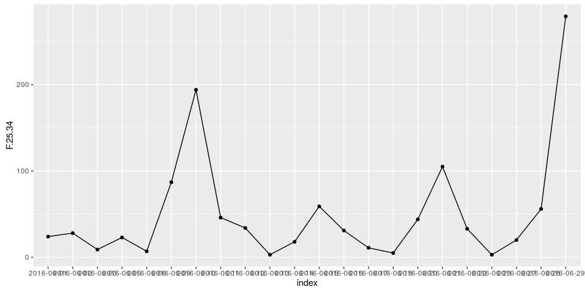
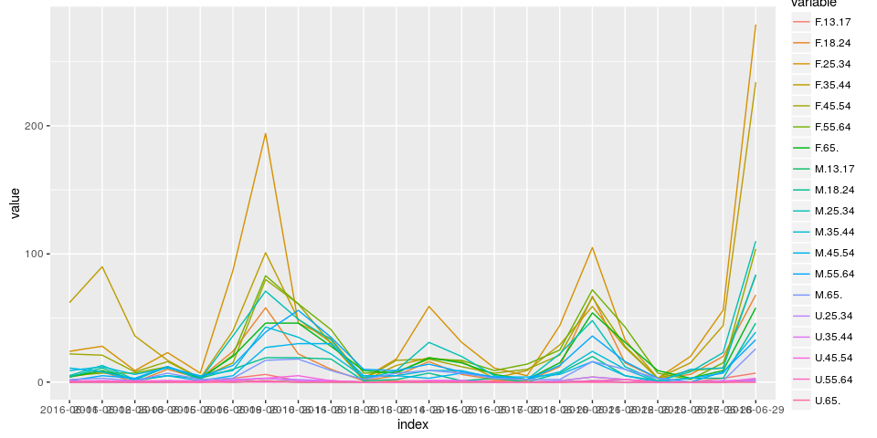
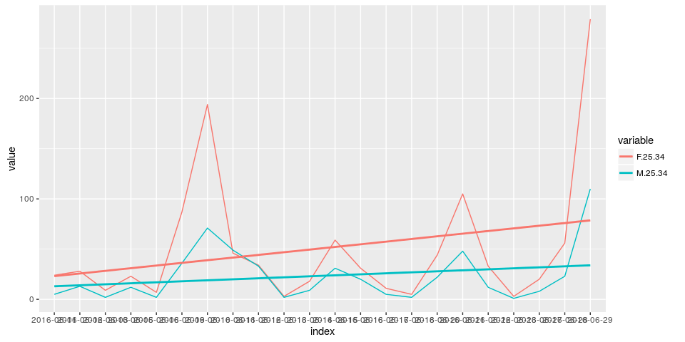
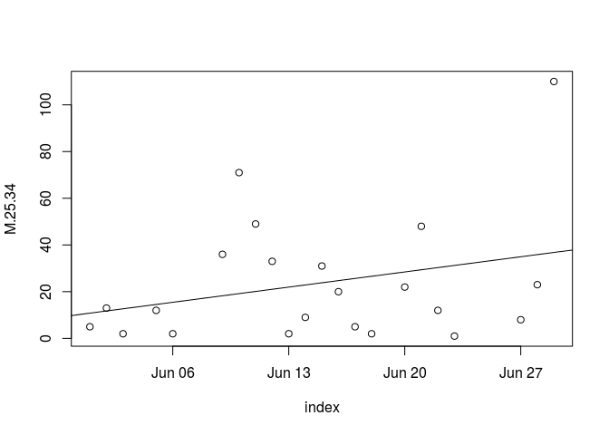

# Working with Facebook Graph API and R
Ben McCary  
`r format(Sys.time(), "%B %d, %Y")`  
    
# Using the Facebook Graph API in R Tool  

Note, key is expired in committed version. Use the following technique to get token/user ignored by git filter:

http://stackoverflow.com/questions/16244969/how-to-tell-git-to-ignore-individual-lines-i-e-gitignore-for-specific-lines-of


```r
#navigates to website
browseURL('https://developers.facebook.com/tools/explorer/')
# try to make something that prompts you for parameters
# INCLUDE:
# 1. date (since, until)
# 2. metric
# 3. period
params <- c("metric=page_impressions_by_age_gender_unique","since=2016-06-1", "until=2016-06-30", "period=day")
token <- readline("What is your page token? ")
```

```
## What is your page token?
```

```r
user <- readline("What is your page username or id? ")
```

```
## What is your page username or id?
```


```r
source("../fb_api.R")
source("../fb_matrix.R")
```


## Getting the data:


```r
token <- "EAACEdEose0cBAHZBqNuTk5XJgCMj4cPBR48sawrLmME1cOjgCLyo71IZCaV1hZB7Q9oVvq8JmkhkkBg13ZBuOAmBGyTnQ1v1quA5ypfYlrcFu6Uyh5vNuwUQKiZC9Dc9GcZAsregezfT9JVbDeUF5Kalpskr1EqWQe14fP03ovZAAZDZD"
user <- "662428190454349"
dat <- fb.api(user, token, params)
```

```
## Loading required package: rjson
```

```r
test <- fb.matrix(dat)
```
## Doing some analysis  
figure out how to make the x-axis all fit. Maybe skip ever other day or something.


```r
# reorganize matrix to be usable by ggplot
require(ggplot2)
```

```
## Loading required package: ggplot2
```

```r
require(reshape2)
```

```
## Loading required package: reshape2
```

```r
g2 <- ggplot(test, aes(index, F.25.34, group=1))+geom_point()+geom_line()
g2
```



```r
g <- ggplot(melt(test), aes(x=index, y=value, col=variable, group=variable))+geom_line()
```

```
## Using index as id variables
```

```r
g
```



```r
require(dplyr)
```

```
## Loading required package: dplyr
```

```
## 
## Attaching package: 'dplyr'
```

```
## The following objects are masked from 'package:stats':
## 
##     filter, lag
```

```
## The following objects are masked from 'package:base':
## 
##     intersect, setdiff, setequal, union
```

```r
m <- melt(test)
```

```
## Using index as id variables
```

```r
m2 <- filter(m, variable%in%c("F.25.34","M.25.34"))
g3 <- ggplot(m2, aes(x=index, y=value, col=variable, group=variable))+geom_line()+geom_smooth(method = "lm", se = F)
g3
```




## First stab at a linear model

```r
test2 <- test
test2$index <- as.Date(test2$index)
plot(M.25.34~index, data = test2)
fit <- lm(M.25.34~index, test2)
abline(fit)
```



```r
# 

fit2 <- lm(F.25.34~., data=test2)
summary(fit2)$coef
```

```
##                  Estimate   Std. Error     t value   Pr(>|t|)
## (Intercept) 10302.8129689 9942.3301880  1.03625737 0.40894519
## index          -0.6071554    0.5859868 -1.03612481 0.40899439
## F.13.17         0.9754777    3.3434770  0.29175547 0.79795256
## F.18.24         1.1019124    0.5218995  2.11134956 0.16915894
## F.35.44         0.1164376    0.3509741  0.33175554 0.77161341
## F.45.54        -0.7568287    0.8255058 -0.91680601 0.45602679
## F.55.64         0.1498453    0.3612793  0.41476318 0.71857191
## F.65.           0.7415968    1.0811906  0.68590756 0.56360892
## M.13.17        -1.4042896    7.3350621 -0.19144891 0.86584885
## M.18.24        -0.4536738    0.6695546 -0.67757551 0.56791534
## M.25.34         2.9572432    0.3634241  8.13716897 0.01476891
## M.35.44        -0.2478883    0.7589506 -0.32661982 0.77496856
## M.45.54         0.5481501    0.7207555  0.76052158 0.52637242
## M.55.64        -1.6875875    0.6840832 -2.46693313 0.13244508
## M.65.           0.1798422    1.8409242  0.09769123 0.93108609
## U.25.34       -10.6480548    9.0705684 -1.17391263 0.36129341
## U.35.44       -21.2387837    8.0755670 -2.63000526 0.11925742
## U.45.54         0.7424849    3.1593443  0.23501235 0.83606926
## U.55.64         9.5522824    6.2815940  1.52067811 0.26772424
## U.65.          74.3397900   24.1389138  3.07966592 0.09123719
```

Note that only Males age 25-34 are the only of the coefficients that are pertinent to the model. Perhaps a Poisson GLM would be better suited for this analysis.
